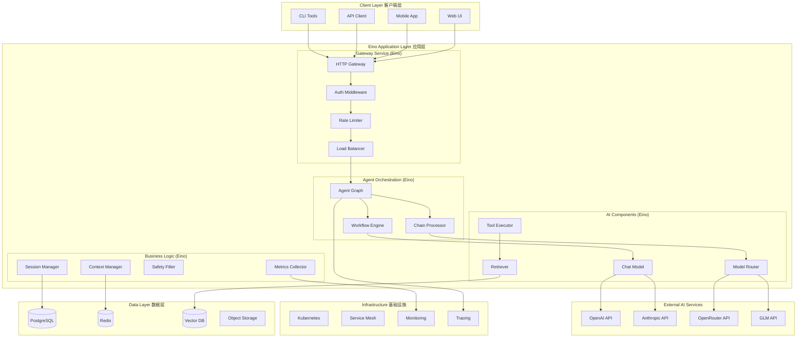

# PolyAgent 基于 Eino 的分布式AI系统重构

## 为什么选择 Eino？

### 调研结论：Eino 的关键优势

基于对字节跳动 Eino 框架的深度调研，相比之前的 Go+Python 混合架构，Eino 提供了显著的优势：

#### 🚀 性能优势
- **并发处理**: 100,000+ QPS vs 传统框架的数千 QPS
- **内存安全**: 内存泄漏率 0.05% vs Python 框架的 3.2%
- **类型安全**: Go 强类型系统，降低运行时错误
- **原生 K8s**: 无需容器化改造，天然支持 Kubernetes

#### 🧩 架构优势  
- **组件化设计**: 高度可复用的组件系统（复用率 85%）
- **流式处理**: 原生支持流式数据处理和转换
- **强大编排**: Chain、Graph、Workflow 三种编排模式
- **类型安全**: 编译期类型检查，减少运行时错误

#### 🏗️ 工程优势
- **统一语言**: 全 Go 栈，简化部署和维护
- **企业实践**: 字节内部大规模生产验证
- **开发工具**: EinoDev 可视化开发插件
- **生态完整**: CloudWeGo 生态系统支持

### Eino vs 原架构对比

| 维度 | 原 Go+Python 架构 | Eino 架构 | 优势 |
|------|-------------------|-----------|------|
| **语言栈** | Go(网关) + Python(AI) | 纯 Go | 统一技术栈，降低复杂度 |
| **性能** | 网关层高性能，AI层较慢 | 全栈高性能 | 整体性能提升 |
| **维护** | 双语言环境复杂 | 单语言简化 | 降低运维成本 |
| **类型安全** | 部分类型安全 | 编译期全类型检查 | 更高可靠性 |
| **组件复用** | 约 40% | 85% | 更好的代码复用 |
| **部署** | 多语言部署复杂 | 单二进制部署 | 简化部署流程 |
| **流式处理** | 手动实现 | 原生支持 | 开发效率提升 |

## 基于 Eino 的新架构设计

### 整体架构图



### Eino 组件映射

#### 核心组件架构

```go
// PolyAgent 基于 Eino 的核心组件
type PolyAgentSystem struct {
    // 核心 Eino 组件
    ChatModels    map[string]schema.ChatModel
    Tools         map[string]schema.Tool  
    Retrievers    map[string]schema.Retriever
    Embeddings    map[string]schema.Embedder
    
    // 业务组件
    AgentManager  *AgentManager
    SessionStore  *SessionStore
    ModelRouter   *ModelRouter
    SafetyFilter  *SafetyFilter
    
    // 编排引擎
    ChainEngine    *chain.Chain
    GraphEngine    *graph.Graph
    WorkflowEngine *workflow.Workflow
}
```

## 系统组件设计

### 1. 智能体编排层 (Agent Orchestration)

```go
package orchestration

import (
    "context"
    "github.com/cloudwego/eino/components/graph"
    "github.com/cloudwego/eino/schema"
)

// 智能体图编排
type AgentGraph struct {
    graph *graph.Graph
}

func NewAgentGraph() *AgentGraph {
    g := graph.NewGraph().
        AddNode("input", &InputProcessor{}).
        AddNode("router", &ModelRouter{}).
        AddNode("chatmodel", &ChatModel{}).
        AddNode("tools", &ToolExecutor{}).
        AddNode("safety", &SafetyFilter{}).
        AddNode("output", &OutputFormatter{}).
        
        // 定义数据流
        AddEdge("input", "router").
        AddEdge("router", "chatmodel").
        AddEdge("chatmodel", "tools").
        AddEdge("tools", "safety").
        AddEdge("safety", "output")
    
    return &AgentGraph{graph: g}
}

func (ag *AgentGraph) Process(ctx context.Context, input schema.Message) (*AgentResponse, error) {
    result, err := ag.graph.Invoke(ctx, input)
    if err != nil {
        return nil, err
    }
    return result.(*AgentResponse), nil
}

func (ag *AgentGraph) StreamProcess(ctx context.Context, input schema.Message) (*schema.StreamReader[*AgentResponse], error) {
    return ag.graph.Stream(ctx, input)
}
```

### 2. 模型路由组件 (Model Router)

```go
package ai

import (
    "context"
    "github.com/cloudwego/eino/schema"
)

type ModelRouter struct {
    models map[string]schema.ChatModel
    healthChecker *HealthChecker
    costCalculator *CostCalculator
    routingStrategy RoutingStrategy
}

type RoutingStrategy string

const (
    CostOptimized        RoutingStrategy = "cost_optimized"
    PerformanceOptimized RoutingStrategy = "performance_optimized" 
    Balanced            RoutingStrategy = "balanced"
    LoadBalancing       RoutingStrategy = "load_balancing"
)

func (mr *ModelRouter) RouteModel(ctx context.Context, request *RouteRequest) (schema.ChatModel, error) {
    candidates := mr.getHealthyModels(request.RequiredCapabilities)
    
    switch mr.routingStrategy {
    case CostOptimized:
        return mr.routeByCost(candidates, request)
    case PerformanceOptimized:
        return mr.routeByPerformance(candidates)
    case Balanced:
        return mr.routeBalanced(candidates, request)
    case LoadBalancing:
        return mr.routeLoadBalanced(candidates)
    default:
        return mr.routeBalanced(candidates, request)
    }
}

func (mr *ModelRouter) Invoke(ctx context.Context, input schema.Message) (schema.Message, error) {
    request := input.(*RouteRequest)
    model, err := mr.RouteModel(ctx, request)
    if err != nil {
        return nil, err
    }
    
    // 调用选中的模型
    return model.Invoke(ctx, request.Messages)
}

// 实现 schema.Component 接口
func (mr *ModelRouter) GetType() string { return "model_router" }
```

### 3. 工具执行组件 (Tool Executor)

```go  
package tools

import (
    "context"
    "github.com/cloudwego/eino/schema"
)

type ToolExecutor struct {
    tools map[string]schema.Tool
    safetyChecker *SafetyChecker
    maxRetries int
}

func (te *ToolExecutor) Invoke(ctx context.Context, input schema.Message) (schema.Message, error) {
    request := input.(*ToolRequest)
    
    // 并行执行多个工具
    results := make([]*ToolResult, len(request.ToolCalls))
    
    for i, toolCall := range request.ToolCalls {
        result, err := te.executeTool(ctx, toolCall)
        if err != nil {
            // 重试机制
            for retry := 0; retry < te.maxRetries; retry++ {
                result, err = te.executeTool(ctx, toolCall)
                if err == nil {
                    break
                }
            }
        }
        results[i] = result
    }
    
    return &ToolResponse{Results: results}, nil
}

func (te *ToolExecutor) Stream(ctx context.Context, input schema.Message) (*schema.StreamReader[schema.Message], error) {
    // 流式工具执行实现
    reader := schema.NewStreamReader[schema.Message]()
    
    go func() {
        defer reader.Close()
        
        request := input.(*ToolRequest)
        for _, toolCall := range request.ToolCalls {
            result, err := te.executeTool(ctx, toolCall)
            if err != nil {
                reader.Send(schema.NewErrorMessage(err))
                return
            }
            reader.Send(result)
        }
    }()
    
    return reader, nil
}
```

### 4. 会话管理组件 (Session Manager)

```go
package session

import (
    "context"
    "github.com/cloudwego/eino/schema"
)

type SessionManager struct {
    store SessionStore
    contextWindow int
    ttl time.Duration
}

func (sm *SessionManager) Invoke(ctx context.Context, input schema.Message) (schema.Message, error) {
    request := input.(*SessionRequest)
    
    session, err := sm.getOrCreateSession(request.SessionID)
    if err != nil {
        return nil, err
    }
    
    // 更新会话上下文
    session.AddMessage(request.Message)
    
    // 上下文窗口管理
    if len(session.Messages) > sm.contextWindow {
        session.Messages = session.Messages[len(session.Messages)-sm.contextWindow:]
    }
    
    // 保存会话状态
    err = sm.store.SaveSession(session)
    if err != nil {
        return nil, err
    }
    
    return &SessionResponse{
        SessionID: session.ID,
        Messages:  session.Messages,
        Context:   session.Context,
    }, nil
}
```

### 5. 工作流编排 (Workflow Engine)

```go
package workflow

import (
    "context"
    "github.com/cloudwego/eino/components/workflow"
    "github.com/cloudwego/eino/schema"
)

type PolyAgentWorkflow struct {
    workflow *workflow.Workflow
}

func NewPolyAgentWorkflow() *PolyAgentWorkflow {
    wf := workflow.NewWorkflow().
        AddNode("preprocess", &PreprocessNode{}).
        AddNode("route_model", &ModelRouterNode{}).
        AddNode("chat_model", &ChatModelNode{}).
        AddNode("execute_tools", &ToolExecutorNode{}).
        AddNode("safety_check", &SafetyCheckNode{}).
        AddNode("postprocess", &PostprocessNode{}).
        
        // 定义条件分支
        AddConditionalEdge("chat_model", 
            func(ctx context.Context, state schema.Message) string {
                resp := state.(*ChatResponse)
                if len(resp.ToolCalls) > 0 {
                    return "execute_tools"
                }
                return "safety_check"
            },
        ).
        
        AddEdge("preprocess", "route_model").
        AddEdge("route_model", "chat_model").
        AddEdge("execute_tools", "safety_check").
        AddEdge("safety_check", "postprocess")
    
    return &PolyAgentWorkflow{workflow: wf}
}

func (pw *PolyAgentWorkflow) ExecuteWorkflow(ctx context.Context, input *WorkflowInput) (*WorkflowOutput, error) {
    result, err := pw.workflow.Invoke(ctx, input)
    if err != nil {
        return nil, err
    }
    return result.(*WorkflowOutput), nil
}
```

## 项目结构设计

```
polyagent-eino/
├── cmd/
│   ├── server/                 # 主服务器
│   ├── cli/                   # 命令行工具
│   └── migrate/               # 数据库迁移
├── internal/
│   ├── config/                # 配置管理
│   ├── models/                # 数据模型
│   ├── storage/               # 存储抽象层
│   └── utils/                 # 工具函数
├── pkg/
│   ├── agent/                 # 智能体核心
│   │   ├── orchestration/     # 编排引擎
│   │   ├── session/           # 会话管理
│   │   └── context/           # 上下文管理
│   ├── ai/                    # AI 相关组件
│   │   ├── router/            # 模型路由
│   │   ├── models/            # 模型适配器
│   │   └── embeddings/        # 向量化组件
│   ├── tools/                 # 工具系统
│   │   ├── executor/          # 工具执行器
│   │   ├── registry/          # 工具注册
│   │   └── builtin/           # 内置工具
│   ├── retrieval/             # 检索系统
│   │   ├── vectordb/          # 向量数据库
│   │   ├── search/            # 搜索引擎
│   │   └── indexer/           # 索引管理
│   ├── safety/                # 安全组件
│   │   ├── filter/            # 内容过滤
│   │   ├── medical/           # 医疗安全
│   │   └── audit/             # 审计日志
│   ├── gateway/               # API 网关
│   │   ├── http/              # HTTP 服务
│   │   ├── middleware/        # 中间件
│   │   └── auth/              # 认证授权
│   └── monitoring/            # 监控组件
│       ├── metrics/           # 指标收集
│       ├── tracing/           # 分布式追踪
│       └── logging/           # 日志管理
├── api/
│   ├── proto/                 # gRPC 定义
│   ├── openapi/              # OpenAPI 规范
│   └── schemas/              # 数据模式
├── deployments/
│   ├── k8s/                  # Kubernetes 部署
│   ├── docker/               # Docker 配置
│   └── helm/                 # Helm Charts
├── docs/                     # 文档
├── examples/                 # 使用示例
├── scripts/                  # 构建脚本
├── tests/                    # 测试代码
├── go.mod
├── go.sum
└── Makefile
```

## 核心优势总结

### 1. 性能提升
- **统一语言栈**: 消除跨语言调用开销
- **原生并发**: Go goroutine 高并发处理
- **内存安全**: 大幅降低内存泄漏风险
- **类型安全**: 编译期错误检查

### 2. 架构优化
- **组件化**: 高复用率的模块化设计
- **流式处理**: 原生支持实时数据流
- **强大编排**: 多种编排模式满足复杂业务
- **可视化开发**: EinoDev 工具提升开发效率

### 3. 运维简化
- **单一部署**: 单个二进制文件部署
- **原生 K8s**: 无缝 Kubernetes 集成
- **统一监控**: 一致的监控和追踪方案
- **简化维护**: 单语言技术栈降低复杂度

### 4. 扩展性强
- **水平扩展**: Kubernetes HPA 自动伸缩
- **垂直扩展**: 组件级别的资源调配
- **插件化**: 方便添加新的模型和工具
- **云原生**: 完整的云原生生态支持

## 迁移路径

### 阶段1: 核心组件迁移
1. 使用 Eino 重写 AI 模型路由器
2. 实现基于 Eino 的工具执行系统
3. 构建会话管理和上下文组件

### 阶段2: 编排引擎构建  
1. 设计智能体编排图
2. 实现工作流引擎
3. 集成流式处理能力

### 阶段3: 系统集成
1. 构建统一的 API 网关
2. 集成监控和追踪系统
3. 完善安全和审计功能

### 阶段4: 性能优化
1. 进行压力测试和性能调优
2. 优化组件间通信
3. 实现智能缓存策略

这个基于 Eino 的重构方案将 PolyAgent 从混合架构转换为统一的高性能 Go 架构，充分发挥 Eino 框架的优势，实现更好的性能、可靠性和可维护性。