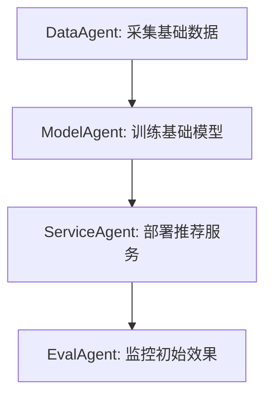
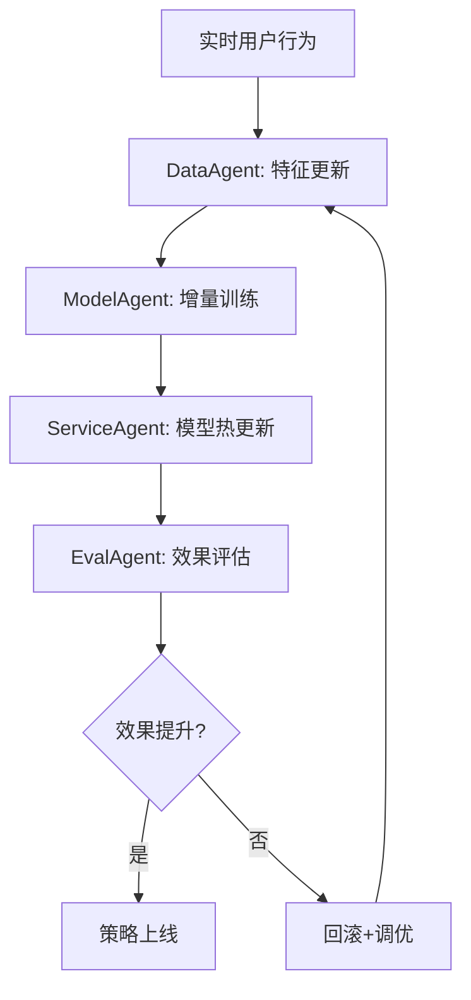

# PolyAgent 推荐业务闭环系统设计

基于对成功案例的调研（Agent4Rec、Microsoft Recommenders、Eugene Yan等），设计专注推荐业务的智能Agent系统。

## 🎯 业务定位

不做通用Agent，专注**推荐业务闭环**：
- 数据采集 → 特征工程 → 模型训练 → 实时推理 → 效果评估 → 策略优化

## 🏗️ 系统架构

### 核心Agent角色设计

```
推荐业务闭环 = 数据Agent + 模型Agent + 服务Agent + 评估Agent
```

#### 1. DataAgent (数据采集工程师)
**职责**: 数据采集、清洗、特征工程
- **工具链**: 
  - 数据爬虫 (Web scraping)
  - 数据库连接器 (MySQL, MongoDB, ClickHouse)
  - 实时流处理 (Kafka消费者)
  - 特征计算引擎

- **智能决策**:
  - 自动识别数据质量问题
  - 动态调整采集频率
  - 特征重要性分析
  - 异常数据告警

#### 2. ModelAgent (算法工程师)
**职责**: 模型训练、优化、部署
- **工具链**:
  - 模型训练框架 (PyTorch, TensorFlow)
  - 超参数优化 (Optuna, Ray Tune)
  - 模型版本管理 (MLflow)
  - 分布式训练

- **智能决策**:
  - 自动选择最优算法
  - 动态调整训练策略
  - 模型性能监控
  - 自动模型更新

#### 3. ServiceAgent (推荐服务工程师)  
**职责**: 实时推理、缓存、负载均衡
- **工具链**:
  - 高性能推理引擎 (TensorRT, ONNX)
  - 缓存系统 (Redis集群)
  - 负载均衡 (NGINX, HAProxy)
  - API网关

- **智能决策**:
  - 自适应缓存策略
  - 动态扩缩容
  - 降级保护
  - 实时性能优化

#### 4. EvalAgent (效果评估师)
**职责**: A/B测试、指标监控、策略优化
- **工具链**:
  - A/B测试平台
  - 指标计算引擎
  - 数据可视化 (Grafana)
  - 报表系统

- **智能决策**:
  - 自动实验设计
  - 统计显著性检验  
  - 策略效果分析
  - 优化建议生成

## 🔄 业务流程设计

### 1. 冷启动阶段


### 2. 运营优化阶段  


## 🛠️ 技术实现路径

### Phase 1: 数据Agent (优先级P0)
基于现有PolyAgent框架，实现：

```go
type DataAgent struct {
    collectors  []DataCollector    // 数据采集器
    processors  []DataProcessor    // 数据处理器  
    features    *FeatureEngine     // 特征工程
    storage     DataStorage        // 数据存储
    monitor     *DataMonitor       // 数据监控
}

// 核心工具
- WebScrapingTool: 商品/用户数据爬取
- DatabaseTool: 多数据源连接
- FeatureEngineTool: 自动特征工程
- DataQualityTool: 数据质量检测
```

### Phase 2: 模型Agent (优先级P0)
```go
type ModelAgent struct {
    algorithms  []Algorithm        // 推荐算法库
    trainer     *ModelTrainer      // 模型训练器
    optimizer   *HyperOptimizer    // 超参数优化
    registry    *ModelRegistry     // 模型注册表
    deployer    *ModelDeployer     // 模型部署器
}

// 核心算法支持
- CollaborativeFiltering (协同过滤)
- ContentBased (内容推荐)  
- DeepLearning (神经网络: Wide&Deep, DeepFM)
- HybridModels (混合推荐)
```

### Phase 3: 服务Agent (优先级P1)
```go
type ServiceAgent struct {
    inference   *InferenceEngine   // 推理引擎
    cache       *CacheManager      // 缓存管理
    router      *RequestRouter     // 请求路由
    monitor     *ServiceMonitor    // 服务监控
}

// 性能目标
- 推理延迟: <50ms (P99)
- 吞吐量: >10,000 QPS
- 可用性: 99.9%
```

### Phase 4: 评估Agent (优先级P1)  
```go
type EvalAgent struct {
    abtest      *ABTestFramework   // A/B测试框架
    metrics     *MetricsCalculator // 指标计算
    analyzer    *EffectAnalyzer    // 效果分析
    reporter    *AutoReporter      // 自动报告
}

// 核心指标
- CTR (点击率)
- CVR (转化率) 
- GMV (成交金额)
- 用户满意度
```

## 📊 数据流设计

### 离线数据流
```
原始数据 → 数据清洗 → 特征工程 → 模型训练 → 模型评估 → 模型部署
```

### 实时数据流  
```
用户行为 → 实时特征 → 模型推理 → 推荐结果 → 效果追踪 → 策略调整
```

### 反馈闭环
```
推荐曝光 → 用户反馈 → 效果分析 → 策略优化 → 模型更新 → 推荐改进
```

## 🎯 业务场景适配

### 电商推荐
- 商品推荐、用户画像、价格策略
- 场景: 首页推荐、相似商品、购物车推荐

### 内容推荐  
- 文章推荐、视频推荐、个性化Feed
- 场景: 信息流、相关推荐、热门内容

### 社交推荐
- 好友推荐、群组推荐、内容分发
- 场景: 人脉扩展、社区发现、内容匹配

## 🚀 实施计划

### 第1周: 数据Agent核心功能
- [ ] 实现数据采集工具链  
- [ ] 构建特征工程pipeline
- [ ] 数据质量监控系统

### 第2周: 模型Agent算法库
- [ ] 集成经典推荐算法
- [ ] 实现自动化训练流程  
- [ ] 模型性能评估体系

### 第3周: 端到端闭环验证
- [ ] 构建简化版推荐服务
- [ ] 实现基础A/B测试
- [ ] 完整业务流程打通

### 第4周: 生产优化
- [ ] 性能调优和扩展
- [ ] 监控告警完善
- [ ] 业务效果验证

## 🔬 成功指标

### 技术指标
- 数据处理延迟 < 1分钟
- 模型训练时间 < 30分钟  
- 推荐服务延迟 < 50ms
- 系统可用性 > 99.9%

### 业务指标
- CTR提升 > 20%
- 用户停留时长增加 > 15%
- 转化率提升 > 10%
- 用户满意度 > 4.0/5.0

---

> 💡 **设计理念**: 不追求Agent通用性，专注推荐业务价值创造。通过Agent智能化各个环节，构建自动化、自优化的推荐业务闭环。