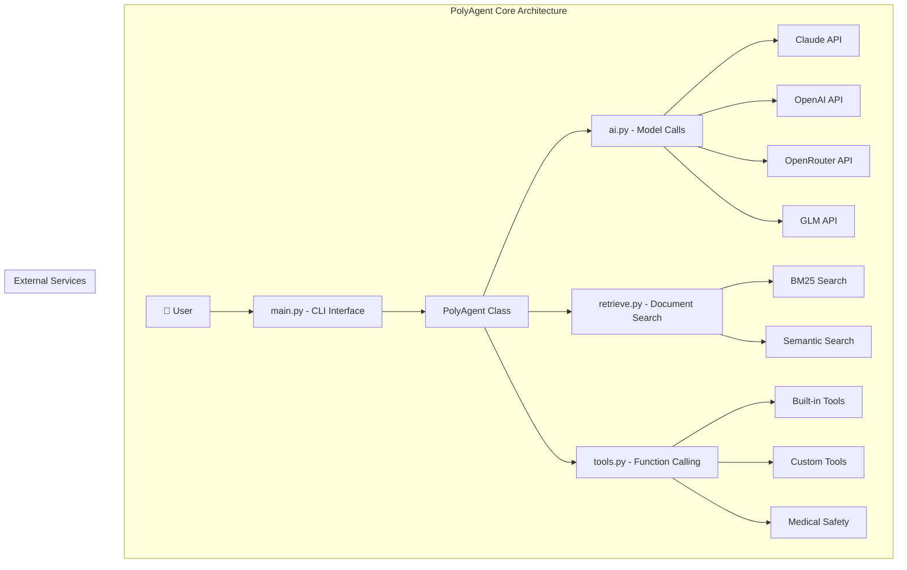
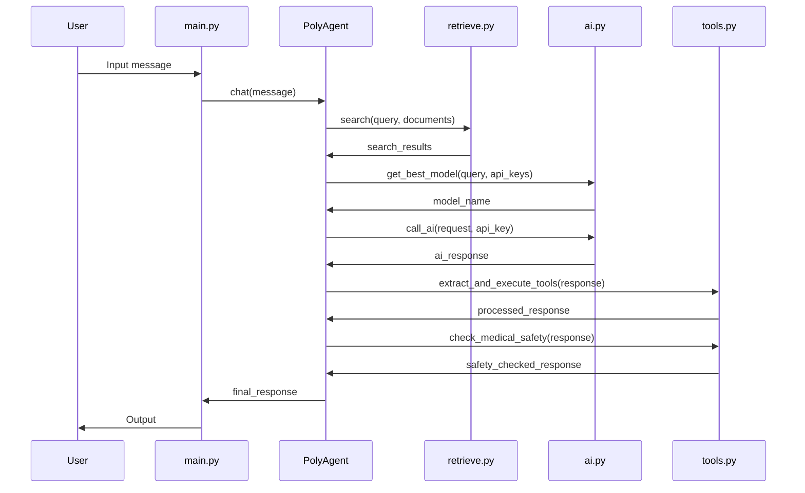
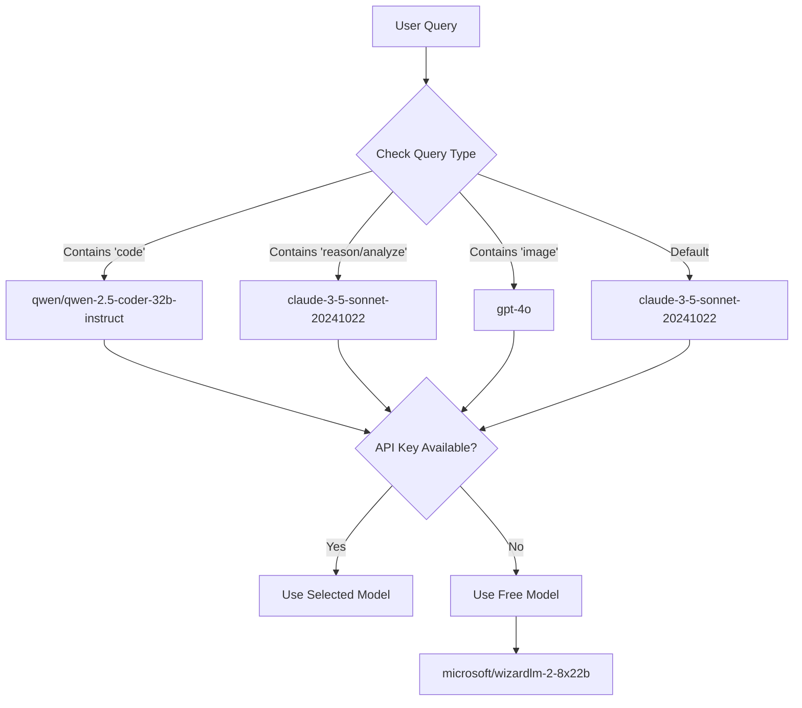
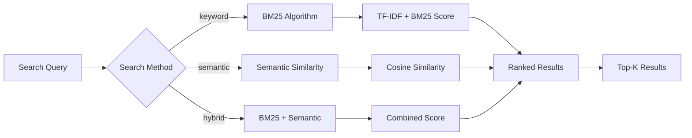
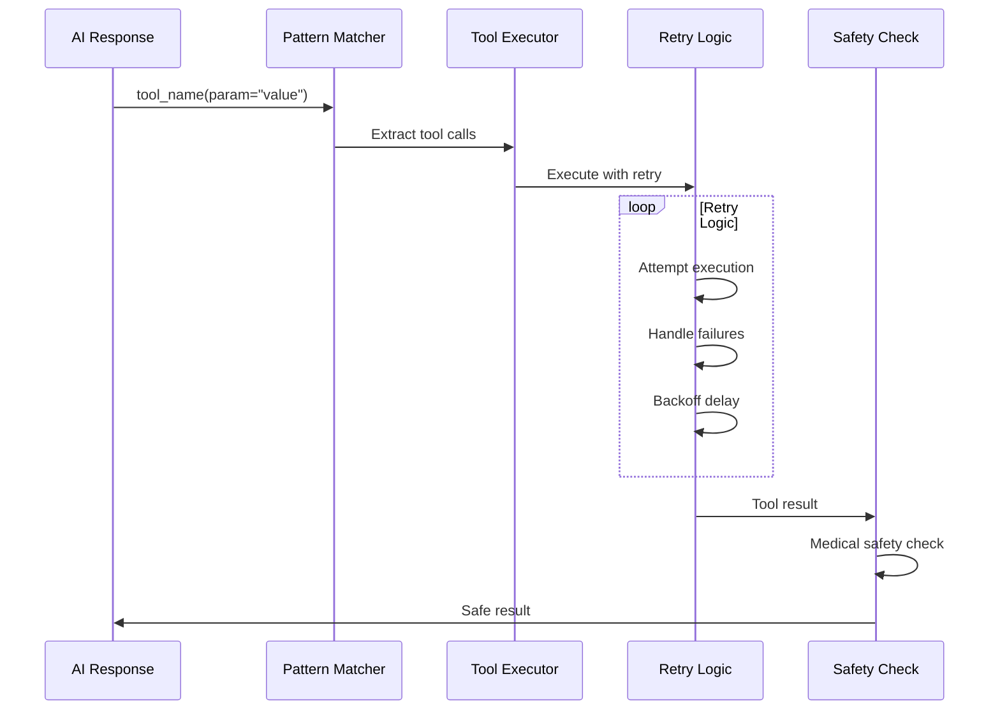
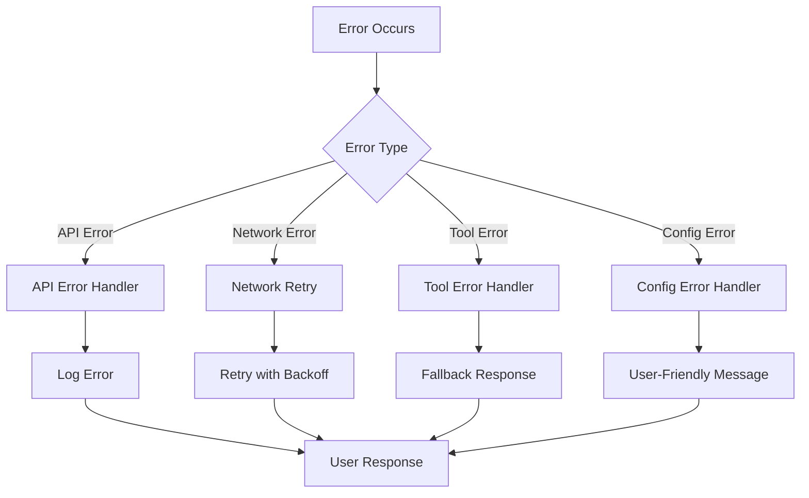

# Core Module - PolyAgent AI Engine

## Overview

Core模块是PolyAgent的核心AI引擎，遵循Linux设计哲学，实现了"Do One Thing Well"的原则。包含4个核心文件，每个文件负责一个明确的职责。

## Architecture



## Data Flow



## Module Breakdown

### 1. main.py - CLI Interface & Orchestration

**职责**: 命令行接口和系统协调

**核心类**:
```python
class PolyAgent:
    def __init__(self, api_keys: Dict[str, str], document_paths: List[str] = None)
    async def chat(self, message: str, context: str = "", use_tools: bool = True) -> str
    async def health_check(self) -> Dict[str, Any]
```

**特性**:
- Unix风格CLI接口（支持管道、环境变量）
- 交互模式和管道模式
- 优雅的错误处理
- 健康检查和监控

### 2. ai.py - AI Model Integration

**职责**: AI模型调用和路由

**核心函数**:
```python
async def call_ai(request: AICall, api_key: str, base_url: str = None) -> AIResponse
def get_best_model(query: str, api_keys: Dict[str, str], free_only: bool = False) -> str
async def test_model(model: str, api_key: str, base_url: str = None) -> bool
```

**支持的模型**:
- **Claude**: claude-3-5-sonnet-20241022, claude-4-opus, claude-4-sonnet
- **OpenAI**: gpt-4o, gpt-5, gpt-4-turbo
- **OpenRouter**: qwen/qwen-2.5-coder-32b-instruct, openrouter/k2-free, qwen/qwen-3-coder-free
- **GLM**: glm-4-plus, glm-4.5-turbo

**模型路由逻辑**:


### 3. retrieve.py - Document Search & RAG

**职责**: 文档检索和相关性匹配

**核心函数**:
```python
async def search(query: str, documents: List[str], method: str = "hybrid", top_k: int = 5) -> List[SearchResult]
def load_documents(paths: List[str]) -> List[str]
```

**搜索方法**:


**BM25参数**:
- k1 = 1.2 (term frequency saturation)
- b = 0.75 (field length normalization)

### 4. tools.py - Function Calling & Safety

**职责**: 工具调用和安全检查

**核心功能**:
```python
def register_tool(name: str) -> Decorator
async def call_tool(name: str, params: Dict[str, Any], retries: int = 2) -> Any
def check_medical_safety(text: str) -> bool
def add_medical_disclaimer(text: str) -> str
```

**工具执行流程**:


**内置工具**:
- `get_time`: 获取当前时间
- `calculate`: 安全数学计算
- `search_web`: 网络搜索（占位符）
- `weather`: 天气查询（占位符）
- `translate`: 文本翻译（占位符）

**医疗安全模式**:
```python
dangerous_patterns = [
    r'诊断为|确诊为',           # Diagnosis claims
    r'建议.*服用.*药|推荐.*药物',  # Medication recommendations  
    r'不需要看医生|无需就医',      # Discouraging medical care
    r'立即手术|需要手术',         # Surgery recommendations
    r'停止.*药物|停药'           # Stop medication advice
]
```

## Configuration

### Environment Variables

```bash
# API Keys (至少需要一个)
OPENAI_API_KEY=sk-your-key
ANTHROPIC_API_KEY=sk-ant-your-key  
OPENROUTER_API_KEY=sk-or-your-key
GLM_API_KEY=your-glm-key

# Behavior Configuration
POLYAGENT_VERBOSE=true          # 启用详细输出
POLYAGENT_TOOLS=true            # 启用工具调用
POLYAGENT_DOCS=./docs/medical,./docs/tech  # 文档路径
POLYAGENT_LOG_LEVEL=INFO        # 日志级别
```

## Performance Metrics

| 操作 | 延迟 | 吞吐量 |
|-----|------|--------|
| 启动时间 | ~0.5s | N/A |
| AI调用 | 1-3s | 取决于模型 |
| 文档搜索 | 50-200ms | 1000 docs/s |
| 工具调用 | 10-100ms | 100 calls/s |
| 内存使用 | ~50MB | N/A |

## Error Handling



## Testing

```bash
# 基础功能测试
python3 test_simple.py

# 集成测试
python3 ../test_integration_fixed.py

# 模型路由测试
python3 ../test_model_routing.py
```

## Usage Examples

### 基本对话
```bash
python3 main.py
> Hello, how are you?
Assistant: I'm doing well, thank you! How can I help you today?
```

### 代码相关查询
```bash
> Write a Python function to sort a list
Assistant: [Uses qwen/qwen-2.5-coder-32b-instruct automatically]
```

### 工具调用
```bash
> What time is it?
Assistant: get_time()
2024-08-30 14:30:25

> Calculate 15 * 32 + 7
Assistant: calculate(15 * 32 + 7)
487
```

### 管道模式
```bash
echo "Explain quantum computing" | python3 main.py
# 输出解释内容
```

## Extension Points

### 添加新模型
```python
# 在 ai.py 中添加新的 _call_newmodel 函数
# 在 call_ai() 中添加模型路由逻辑
```

### 添加自定义工具
```python
from tools import register_tool

@register_tool("my_tool")
def my_custom_tool(param: str) -> str:
    return f"Processed: {param}"
```

### 自定义搜索方法
```python
# 在 retrieve.py 中添加新的搜索方法
async def search_custom(query: str, documents: List[str]) -> List[SearchResult]:
    # 实现自定义搜索逻辑
    pass
```

---

*Core模块体现了Unix哲学：简单、可靠、可组合。每个文件做好一件事，组合起来形成强大的AI系统。*