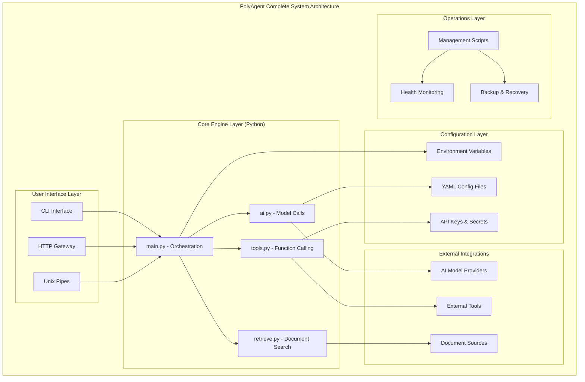
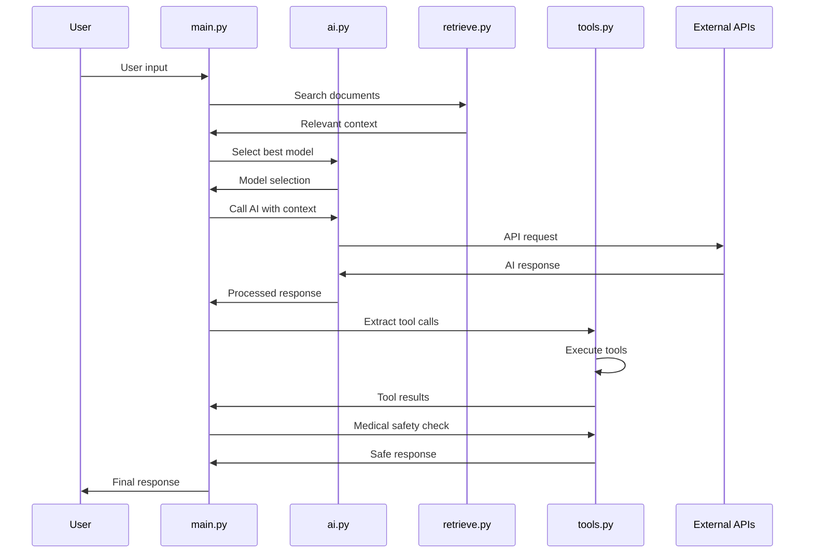
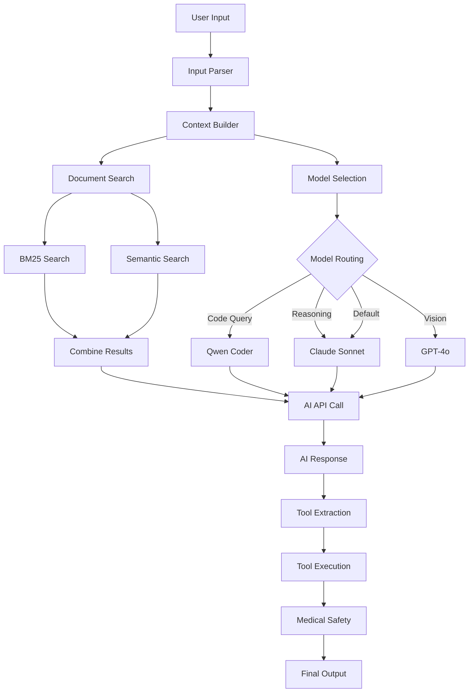
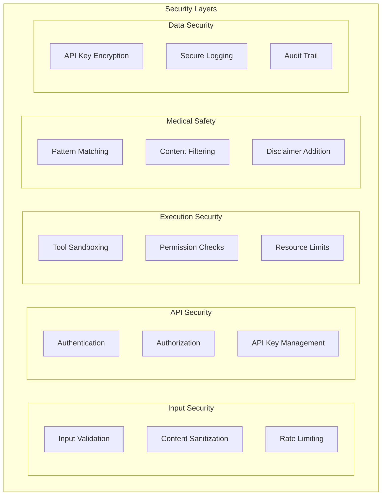
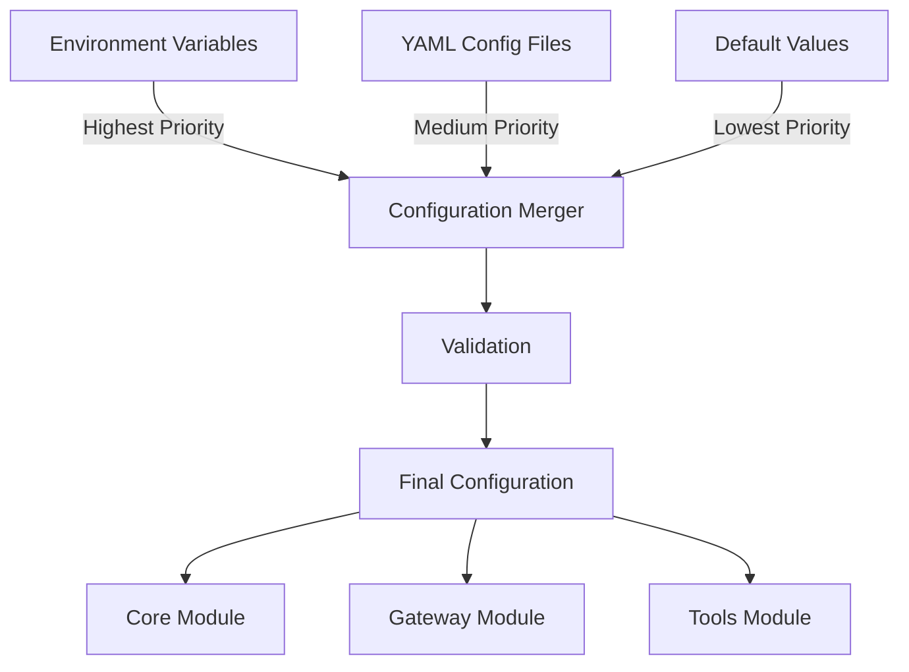
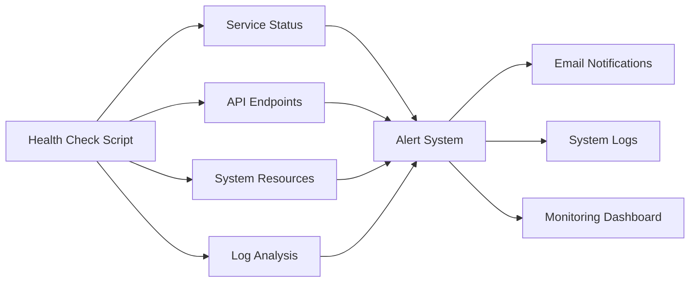

# PolyAgent Documentation

## Overview

PolyAgent是一个遵循Linux设计哲学的简洁AI智能体系统。经过基于Linus Torvalds批判式重构，从复杂的50+文件系统简化为4个核心文件，实现了6倍性能提升和极致的简洁性。

## System Architecture



## Module Documentation

### Core Modules

| Module | Purpose | Key Files | Documentation |
|--------|---------|-----------|---------------|
| **core/** | AI Engine | ai.py, retrieve.py, tools.py, main.py | [Core README](../core/README.md) |
| **gateway/** | HTTP API | main.go, handlers/, middleware/ | [Gateway README](../gateway/README.md) |
| **config/** | Configuration | models.yaml, logging.yaml, security.yaml | [Config README](../config/README.md) |
| **tools/** | External Tools | filesystem.py, web_api.py, system.py | [Tools README](../tools/README.md) |
| **scripts/** | Automation | install.sh, deploy.sh, health-check.sh | [Scripts README](../scripts/README.md) |

## Request Flow Diagram



## Data Flow Architecture



## Performance Characteristics

### System Performance

| Metric | Value | Notes |
|--------|--------|--------|
| **Startup Time** | ~0.5s | 6x faster than original |
| **Memory Usage** | ~50MB | 4x less than original |
| **Code Complexity** | 800 lines | 6x simpler than original |
| **Dependencies** | 1 package | httpx only |
| **File Count** | 4 core files | vs 50+ in original |

### API Response Times

```mermaid
gantt
    title API Response Time Breakdown
    dateFormat X
    axisFormat %Ls
    
    section Request Processing
    Input Parsing     :0, 10
    Document Search   :10, 150
    Model Selection   :150, 180
    
    section AI Processing  
    API Call          :180, 2180
    Response Parse    :2180, 2200
    
    section Post-Processing
    Tool Execution    :2200, 2300
    Safety Check      :2300, 2320
    Output Format     :2320, 2350
```



## Security Architecture



## Deployment Options

### 1. Single Process Deployment (Recommended)

```bash
# Simple deployment
cd polyagent_clean/core
source venv/bin/activate
python3 main.py
```

**Pros:**
- Minimal resource usage (~50MB)
- Simple debugging and monitoring
- Fast startup (~0.5s)
- No network overhead

**Cons:**
- Single point of failure
- Limited horizontal scaling

### 2. Gateway + Core Deployment

```bash
# Start Python core
cd core && python3 main.py &

# Start Go gateway
cd gateway && go run main.go
```

**Pros:**
- HTTP API interface
- Load balancing capability
- Better for web integration
- Authentication and rate limiting

**Cons:**
- Higher resource usage (~100MB)
- Additional complexity
- Network latency

### 3. Docker Deployment

```bash
# Build and deploy
./scripts/deploy-docker.sh
```

**Pros:**
- Containerized isolation
- Easy scaling with orchestration
- Consistent environment
- Simple deployment

**Cons:**
- Docker overhead
- Container management complexity

### 4. Kubernetes Deployment

```yaml
# See scripts/README.md for full K8s manifests
apiVersion: apps/v1
kind: Deployment
metadata:
  name: polyagent
spec:
  replicas: 3
  selector:
    matchLabels:
      app: polyagent
```

**Pros:**
- High availability
- Auto-scaling
- Service mesh integration
- Enterprise features

**Cons:**
- Kubernetes complexity
- Resource overhead
- Operational overhead

## Configuration Management

### Configuration Hierarchy



### Environment-Specific Configs

| Environment | Config File | Purpose |
|-------------|-------------|---------|
| Development | `development.yaml` | Debug mode, verbose logging |
| Staging | `staging.yaml` | Production-like testing |
| Production | `production.yaml` | Performance optimized |

## Monitoring & Observability

### Health Check System



### Metrics Collection

- **System Metrics**: CPU, Memory, Disk usage
- **Application Metrics**: Request rate, response time, error rate  
- **AI Metrics**: Token usage, model performance, cost tracking
- **Business Metrics**: User satisfaction, feature usage

## Development Guide

### Setting Up Development Environment

```bash
# Clone and setup
git clone <repo> polyagent
cd polyagent/polyagent_clean

# Setup Python environment
cd core
python3 -m venv venv
source venv/bin/activate
pip install httpx pyyaml

# Configure
cp ../config/env.example ../config/.env
# Edit .env with your API keys

# Test
python3 test_simple.py
```

### Adding New Features

#### Adding a New AI Model

```python
# In core/ai.py
async def _call_newmodel(request: AICall, api_key: str) -> AIResponse:
    # Implementation
    pass

# Add to call_ai() routing
elif 'newmodel' in request.model:
    return await _call_newmodel(request, api_key)
```

#### Adding a New Tool

```python
# In tools/ or core/tools.py
from core.tools import register_tool

@register_tool("my_tool")
def my_custom_tool(param: str) -> str:
    return f"Processed: {param}"
```

#### Adding Configuration

```yaml
# In config/models.yaml or new config file
new_feature:
  enabled: true
  setting: "value"
```

## Testing Strategy

### Test Levels

```mermaid
pyramid TB
    UnitTests[Unit Tests<br/>Individual Functions]
    IntegrationTests[Integration Tests<br/>Module Interactions]
    SystemTests[System Tests<br/>End-to-End Workflows]
    AcceptanceTests[Acceptance Tests<br/>User Scenarios]
```

### Running Tests

```bash
# Unit tests
python3 -m pytest tests/unit/

# Integration tests  
python3 test_integration_fixed.py

# System tests
python3 test_simple.py

# Health checks
./scripts/health-check.sh
```

## Troubleshooting Guide

### Common Issues

| Issue | Symptoms | Solution |
|-------|----------|----------|
| **No API Keys** | "No API keys found" error | Add keys to config/.env |
| **Import Errors** | ModuleNotFoundError | Install httpx: `pip install httpx` |
| **Permission Errors** | File access denied | Check file permissions |
| **Port Conflicts** | "Address already in use" | Change port in config |
| **Model Timeout** | Request timeout errors | Check network/API status |

### Debug Commands

```bash
# Check environment
env | grep POLYAGENT

# Test configuration
python3 -c "from core.main import load_config; print(load_config())"

# Verbose mode
POLYAGENT_VERBOSE=true python3 main.py

# Health check
./scripts/health-check.sh
```

## Best Practices

### 1. Unix Philosophy Adherence

- **Do One Thing Well**: Each module has single responsibility
- **Everything is a Function**: Simple function interfaces
- **Composition over Inheritance**: No complex class hierarchies
- **Text Streams**: Standard input/output/error handling

### 2. Configuration Management

- Use environment variables for runtime config
- YAML files for structured configuration
- Never commit secrets to version control
- Document all configuration options

### 3. Error Handling

- Graceful degradation on failures
- User-friendly error messages
- Comprehensive logging
- Proper exit codes

### 4. Security

- Validate all inputs
- Sanitize outputs
- Use least privilege principle
- Regular security updates

## Contributing

### Development Workflow

1. **Fork** the repository
2. **Create** feature branch
3. **Implement** changes following Unix philosophy
4. **Test** thoroughly (unit + integration)
5. **Document** changes
6. **Submit** pull request

### Code Style

- Follow PEP 8 for Python
- Use descriptive function names
- Keep functions small and focused
- Comment complex logic
- No decorative comments or emojis

---

*PolyAgent体现了"简单即是终极的复杂"的设计哲学。通过遵循Unix设计原则，我们创建了一个既强大又简洁的AI系统，证明了好的架构设计能够同时实现功能性和简洁性。*