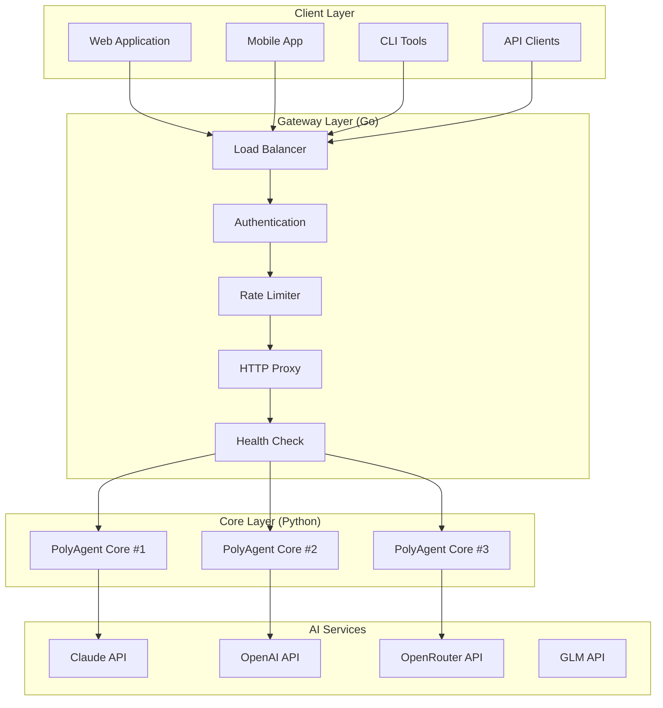
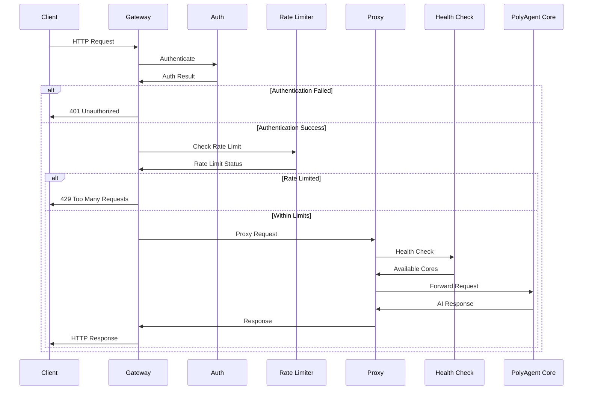
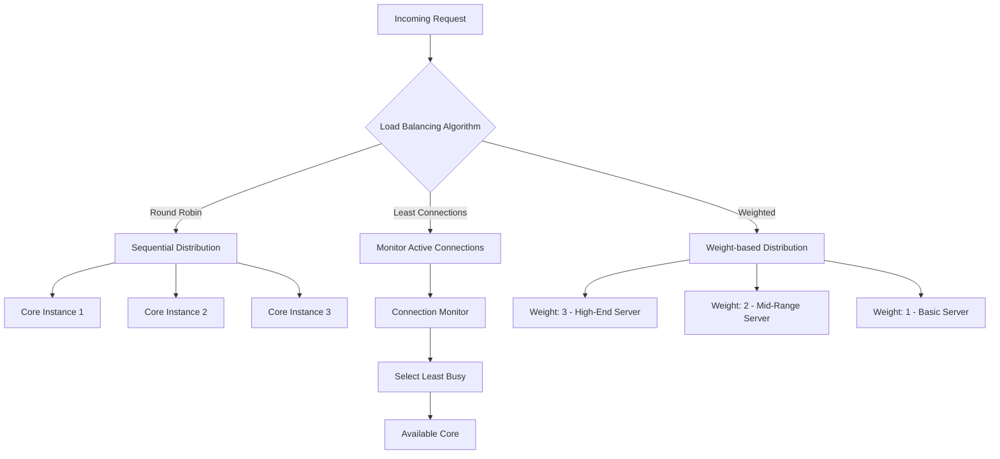
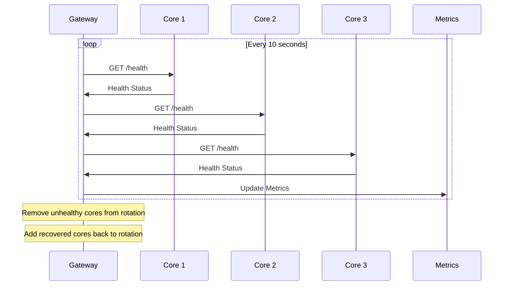
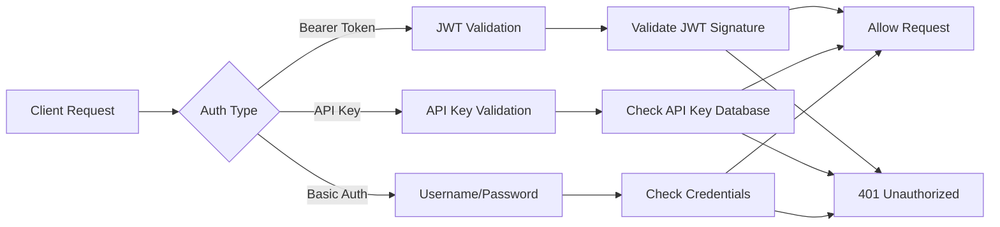

# Gateway Module - HTTP API Gateway

## Overview

Gateway模块是PolyAgent的可选HTTP API网关，使用Go语言编写，提供高性能的HTTP接口来访问Python AI核心。遵循微服务架构原则，负责HTTP协议转换、负载均衡、请求路由等职责。

## Architecture



## Request Flow



## API Endpoints

### Chat Endpoint
```http
POST /api/v1/chat
Content-Type: application/json
Authorization: Bearer <token>

{
  "message": "Hello, how are you?",
  "context": "Previous conversation context",
  "use_tools": true,
  "stream": false,
  "model_preference": "claude"
}
```

**Response**:
```json
{
  "response": "I'm doing well, thank you! How can I help you today?",
  "model_used": "claude-3-5-sonnet-20241022",
  "usage": {
    "prompt_tokens": 25,
    "completion_tokens": 15,
    "total_tokens": 40
  },
  "cost": 0.0012,
  "tools_called": [],
  "processing_time_ms": 1250
}
```

### Health Check Endpoint
```http
GET /api/v1/health
```

**Response**:
```json
{
  "status": "healthy",
  "gateway": {
    "uptime": "24h15m30s",
    "version": "1.0.0",
    "go_version": "1.21.0"
  },
  "cores": {
    "available": 3,
    "total": 3,
    "health": [
      {
        "id": "core-1",
        "status": "healthy",
        "last_check": "2024-08-30T14:30:25Z",
        "response_time_ms": 45
      }
    ]
  },
  "models": {
    "claude": "available",
    "openai": "available", 
    "openrouter": "available",
    "glm": "available"
  }
}
```

### Models Endpoint
```http
GET /api/v1/models
```

**Response**:
```json
{
  "models": [
    {
      "id": "claude-3-5-sonnet-20241022",
      "provider": "anthropic",
      "type": "reasoning",
      "cost_per_1k_tokens": {
        "input": 0.003,
        "output": 0.015
      },
      "capabilities": ["text", "reasoning", "analysis"]
    }
  ]
}
```

## Configuration

### Gateway Configuration (config.yaml)

```yaml
gateway:
  port: 8080
  host: "0.0.0.0"
  timeout: "30s"
  max_request_size: "10MB"

cors:
  enabled: true
  origins: ["*"]
  methods: ["GET", "POST", "OPTIONS"]
  headers: ["Content-Type", "Authorization"]

auth:
  enabled: true
  type: "bearer"  # bearer, basic, apikey
  secret_key: "${AUTH_SECRET_KEY}"

rate_limiting:
  enabled: true
  requests_per_minute: 60
  burst: 10
  cleanup_interval: "1m"

load_balancer:
  algorithm: "round_robin"  # round_robin, least_connections, weighted
  health_check_interval: "10s"
  retry_attempts: 3

cores:
  - url: "http://localhost:8001"
    weight: 1
  - url: "http://localhost:8002" 
    weight: 1
  - url: "http://localhost:8003"
    weight: 1

logging:
  level: "info"
  format: "json"
  output: "stdout"

metrics:
  enabled: true
  port: 9090
  path: "/metrics"
```

## Load Balancing Strategies



## Error Handling

### Gateway Error Types

```mermaid
flowchart TD
    Error[Gateway Error] --> Type{Error Classification}
    
    Type -->|4xx Client Error| ClientError[Client Error Handler]
    Type -->|5xx Server Error| ServerError[Server Error Handler]
    Type -->|Core Unavailable| CoreError[Core Error Handler]
    Type -->|Timeout| TimeoutError[Timeout Handler]
    
    ClientError --> ClientResponse[{"error": "Bad Request", "code": 400}]
    ServerError --> ServerResponse[{"error": "Internal Server Error", "code": 500}]
    CoreError --> Failover[Failover to Healthy Core]
    TimeoutError --> TimeoutResponse[{"error": "Request Timeout", "code": 504}]
    
    Failover --> Retry[Retry Request]
    Retry --> Success[Successful Response]
    Retry --> AllDown[All Cores Down]
    AllDown --> MaintenanceMode[{"error": "Service Unavailable", "code": 503}]
```

### Error Response Format

```json
{
  "error": {
    "code": "INTERNAL_SERVER_ERROR",
    "message": "An internal server error occurred",
    "details": "Core service unavailable",
    "timestamp": "2024-08-30T14:30:25Z",
    "request_id": "req_123456789"
  }
}
```

## Monitoring & Metrics

### Prometheus Metrics

```go
// Request metrics
http_requests_total{method="POST", endpoint="/api/v1/chat", status="200"}
http_request_duration_seconds{method="POST", endpoint="/api/v1/chat"}

// Core health metrics  
core_health_status{core_id="core-1", status="healthy"}
core_response_time_ms{core_id="core-1"}

// Rate limiting metrics
rate_limit_hits_total{client_id="client_123"}
rate_limit_blocks_total{client_id="client_123"}

// Load balancer metrics
load_balancer_requests_total{algorithm="round_robin", core="core-1"}
load_balancer_errors_total{algorithm="round_robin", core="core-1"}
```

### Health Check Flow



## Performance Benchmarks

| Metric | Value | Notes |
|--------|--------|--------|
| RPS (Requests/sec) | 1000+ | Simple requests |
| Latency (P50) | <5ms | Gateway overhead only |
| Latency (P95) | <15ms | Gateway overhead only |
| Memory Usage | ~20MB | Base memory footprint |
| CPU Usage | <5% | At 1000 RPS |
| Concurrent Connections | 10,000+ | With connection pooling |

## Security Features

### Authentication Methods



### Rate Limiting Algorithm

```go
// Token bucket algorithm implementation
type RateLimiter struct {
    capacity int64     // Maximum tokens
    tokens   int64     // Current tokens
    refillRate int64   // Tokens per second
    lastRefill time.Time
}

func (rl *RateLimiter) Allow() bool {
    rl.refill()
    if rl.tokens > 0 {
        rl.tokens--
        return true
    }
    return false
}
```

## Deployment Options

### Single Instance
```bash
# Build
go build -o gateway main.go

# Run
./gateway --config config.yaml
```

### Docker Deployment
```dockerfile
FROM golang:1.21-alpine AS builder
WORKDIR /app
COPY . .
RUN go build -o gateway main.go

FROM alpine:latest
RUN apk add --no-cache ca-certificates
COPY --from=builder /app/gateway /gateway
EXPOSE 8080
CMD ["/gateway"]
```

### Kubernetes Deployment
```yaml
apiVersion: apps/v1
kind: Deployment
metadata:
  name: polyagent-gateway
spec:
  replicas: 3
  selector:
    matchLabels:
      app: polyagent-gateway
  template:
    metadata:
      labels:
        app: polyagent-gateway
    spec:
      containers:
      - name: gateway
        image: polyagent/gateway:latest
        ports:
        - containerPort: 8080
        env:
        - name: AUTH_SECRET_KEY
          valueFrom:
            secretKeyRef:
              name: polyagent-secrets
              key: auth-secret
```

## Development

### Local Development Setup
```bash
# Install dependencies
go mod download

# Run in development mode
go run main.go --config config.dev.yaml

# Run tests
go test ./...

# Build
make build
```

### Project Structure
```
gateway/
├── main.go              # Main entry point
├── config/
│   └── config.go        # Configuration loading
├── handlers/
│   ├── chat.go         # Chat endpoint handler
│   ├── health.go       # Health check handler
│   └── models.go       # Models endpoint handler
├── middleware/
│   ├── auth.go         # Authentication middleware
│   ├── ratelimit.go    # Rate limiting middleware
│   └── cors.go         # CORS middleware
├── loadbalancer/
│   └── roundrobin.go   # Load balancing algorithms
├── metrics/
│   └── prometheus.go   # Prometheus metrics
└── Dockerfile
```

## API Client Examples

### JavaScript/Node.js
```javascript
const axios = require('axios');

const client = axios.create({
  baseURL: 'http://localhost:8080/api/v1',
  headers: {
    'Authorization': 'Bearer your-token-here',
    'Content-Type': 'application/json'
  }
});

async function chat(message) {
  const response = await client.post('/chat', {
    message: message,
    use_tools: true
  });
  return response.data;
}
```

### Python
```python
import httpx

class PolyAgentClient:
    def __init__(self, base_url="http://localhost:8080/api/v1", token=""):
        self.client = httpx.AsyncClient(
            base_url=base_url,
            headers={"Authorization": f"Bearer {token}"}
        )
    
    async def chat(self, message, use_tools=True):
        response = await self.client.post("/chat", json={
            "message": message,
            "use_tools": use_tools
        })
        return response.json()
```

### cURL
```bash
curl -X POST http://localhost:8080/api/v1/chat \
  -H "Authorization: Bearer your-token-here" \
  -H "Content-Type: application/json" \
  -d '{
    "message": "Hello, how are you?",
    "use_tools": true
  }'
```

---

*Gateway模块提供了生产级的HTTP接口，支持负载均衡、认证、限流等企业级功能，同时保持了与Python核心的简洁设计理念。*