# Scripts Module - Automation & Utilities

## Overview

Scripts模块提供了PolyAgent系统的自动化脚本和实用工具，遵循Unix传统的shell脚本设计哲学。每个脚本都是独立的可执行文件，专注于解决特定的系统管理、部署或维护任务。

## Architecture

```mermaid
graph TB
    subgraph "Scripts Architecture"
        User[👤 System Administrator] --> CLI[Command Line Interface]
        
        CLI --> Setup[Setup Scripts]
        CLI --> Deploy[Deployment Scripts]
        CLI --> Monitor[Monitoring Scripts]
        CLI --> Maint[Maintenance Scripts]
        
        Setup --> Install[install.sh]
        Setup --> Config[configure.sh]
        Setup --> Deps[dependencies.sh]
        
        Deploy --> Single[deploy-single.sh]
        Deploy --> Cluster[deploy-cluster.sh]
        Deploy --> Docker[deploy-docker.sh]
        
        Monitor --> Health[health-check.sh]
        Monitor --> Metrics[collect-metrics.sh]
        Monitor --> Logs[analyze-logs.sh]
        
        Maint --> Backup[backup.sh]
        Maint --> Cleanup[cleanup.sh]
        Maint --> Update[update.sh]
    end
```



## Script Categories

### 1. Setup & Installation Scripts

#### install.sh - System Installation
```bash
#!/bin/bash
# install.sh - PolyAgent System Installation Script

set -euo pipefail  # Strict error handling

# Configuration
POLYAGENT_HOME="${POLYAGENT_HOME:-/opt/polyagent}"
POLYAGENT_USER="${POLYAGENT_USER:-polyagent}"
PYTHON_VERSION="3.11"

# Colors for output
RED='\033[0;31m'
GREEN='\033[0;32m'
YELLOW='\033[1;33m'
BLUE='\033[0;34m'
NC='\033[0m' # No Color

log() {
    echo -e "${BLUE}[$(date +'%Y-%m-%d %H:%M:%S')] $1${NC}"
}

error() {
    echo -e "${RED}[ERROR] $1${NC}" >&2
}

success() {
    echo -e "${GREEN}[SUCCESS] $1${NC}"
}

warn() {
    echo -e "${YELLOW}[WARN] $1${NC}"
}

# Check if running as root
check_root() {
    if [[ $EUID -eq 0 ]]; then
        error "This script should not be run as root"
        exit 1
    fi
}

# Detect operating system
detect_os() {
    if [[ "$OSTYPE" == "linux-gnu"* ]]; then
        if command -v apt-get &> /dev/null; then
            OS="ubuntu"
        elif command -v yum &> /dev/null; then
            OS="rhel"
        else
            OS="linux"
        fi
    elif [[ "$OSTYPE" == "darwin"* ]]; then
        OS="macos"
    else
        error "Unsupported operating system: $OSTYPE"
        exit 1
    fi
    log "Detected OS: $OS"
}

# Install system dependencies
install_dependencies() {
    log "Installing system dependencies..."
    
    case $OS in
        "ubuntu")
            sudo apt-get update
            sudo apt-get install -y python3.11 python3.11-venv python3.11-dev
            sudo apt-get install -y build-essential curl wget git
            ;;
        "rhel")
            sudo yum install -y python311 python311-devel
            sudo yum install -y gcc gcc-c++ make curl wget git
            ;;
        "macos")
            if ! command -v brew &> /dev/null; then
                warn "Homebrew not found. Installing Homebrew..."
                /bin/bash -c "$(curl -fsSL https://raw.githubusercontent.com/Homebrew/install/HEAD/install.sh)"
            fi
            brew install python@3.11
            ;;
    esac
}

# Setup Python environment
setup_python() {
    log "Setting up Python environment..."
    
    # Create virtual environment
    python3.11 -m venv "$POLYAGENT_HOME/venv"
    source "$POLYAGENT_HOME/venv/bin/activate"
    
    # Upgrade pip
    pip install --upgrade pip setuptools wheel
    
    # Install core dependencies
    pip install httpx pyyaml
    
    success "Python environment ready"
}

# Install PolyAgent
install_polyagent() {
    log "Installing PolyAgent..."
    
    # Create directory structure
    sudo mkdir -p "$POLYAGENT_HOME"/{core,config,logs,data}
    sudo chown -R "$USER:$USER" "$POLYAGENT_HOME"
    
    # Copy core files
    cp -r core/* "$POLYAGENT_HOME/core/"
    cp -r config/* "$POLYAGENT_HOME/config/"
    
    # Make scripts executable
    chmod +x "$POLYAGENT_HOME/core/main.py"
    
    success "PolyAgent installed to $POLYAGENT_HOME"
}

# Create systemd service
create_service() {
    if [[ "$OS" != "linux" ]]; then
        warn "Systemd service creation skipped (not on Linux)"
        return
    fi
    
    log "Creating systemd service..."
    
    sudo tee /etc/systemd/system/polyagent.service > /dev/null <<EOF
[Unit]
Description=PolyAgent AI Assistant
After=network.target

[Service]
Type=simple
User=$USER
WorkingDirectory=$POLYAGENT_HOME/core
Environment=PATH=$POLYAGENT_HOME/venv/bin
ExecStart=$POLYAGENT_HOME/venv/bin/python main.py
Restart=always
RestartSec=10

[Install]
WantedBy=multi-user.target
EOF

    sudo systemctl daemon-reload
    sudo systemctl enable polyagent
    
    success "Systemd service created"
}

# Main installation flow
main() {
    log "Starting PolyAgent installation..."
    
    check_root
    detect_os
    install_dependencies
    setup_python
    install_polyagent
    create_service
    
    success "PolyAgent installation completed!"
    log "Next steps:"
    log "1. Configure API keys: $POLYAGENT_HOME/config/.env"
    log "2. Start service: sudo systemctl start polyagent"
    log "3. Check status: sudo systemctl status polyagent"
}

# Run main function if script is executed directly
if [[ "${BASH_SOURCE[0]}" == "${0}" ]]; then
    main "$@"
fi
```

#### configure.sh - Configuration Setup
```bash
#!/bin/bash
# configure.sh - PolyAgent Configuration Setup

set -euo pipefail

POLYAGENT_HOME="${POLYAGENT_HOME:-/opt/polyagent}"
CONFIG_DIR="$POLYAGENT_HOME/config"

# Interactive configuration setup
setup_api_keys() {
    echo "Setting up API keys..."
    echo "You can skip any provider by pressing Enter without entering a key."
    echo
    
    # Create .env file
    ENV_FILE="$CONFIG_DIR/.env"
    cat > "$ENV_FILE" <<EOF
# PolyAgent API Configuration
# Generated on $(date)

EOF
    
    # OpenAI
    echo -n "OpenAI API Key (for GPT models): "
    read -r openai_key
    if [[ -n "$openai_key" ]]; then
        echo "OPENAI_API_KEY=$openai_key" >> "$ENV_FILE"
    fi
    
    # Anthropic
    echo -n "Anthropic API Key (for Claude models): "
    read -r anthropic_key
    if [[ -n "$anthropic_key" ]]; then
        echo "ANTHROPIC_API_KEY=$anthropic_key" >> "$ENV_FILE"
    fi
    
    # OpenRouter
    echo -n "OpenRouter API Key (for open source models): "
    read -r openrouter_key
    if [[ -n "$openrouter_key" ]]; then
        echo "OPENROUTER_API_KEY=$openrouter_key" >> "$ENV_FILE"
    fi
    
    # GLM
    echo -n "GLM API Key (for Chinese models): "
    read -r glm_key
    if [[ -n "$glm_key" ]]; then
        echo "GLM_API_KEY=$glm_key" >> "$ENV_FILE"
    fi
    
    # Behavior settings
    cat >> "$ENV_FILE" <<EOF

# Behavior Configuration
POLYAGENT_VERBOSE=false
POLYAGENT_TOOLS=true
POLYAGENT_LOG_LEVEL=INFO

# Document paths (comma-separated)
# POLYAGENT_DOCS=/path/to/docs1,/path/to/docs2

# Gateway settings (if using HTTP gateway)
# GATEWAY_PORT=8080
# AUTH_SECRET_KEY=your-secret-key-here
EOF
    
    chmod 600 "$ENV_FILE"
    echo "Configuration saved to $ENV_FILE"
}

# Test configuration
test_configuration() {
    echo "Testing configuration..."
    
    # Source environment
    set -a
    source "$CONFIG_DIR/.env"
    set +a
    
    # Test Python environment
    if "$POLYAGENT_HOME/venv/bin/python" -c "import core.main; print('✓ Core modules import OK')" 2>/dev/null; then
        echo "✓ Python environment OK"
    else
        echo "✗ Python environment issue"
        return 1
    fi
    
    # Test API keys (basic format validation)
    if [[ -n "${OPENAI_API_KEY:-}" ]]; then
        if [[ "$OPENAI_API_KEY" =~ ^sk-[a-zA-Z0-9]{48}$ ]]; then
            echo "✓ OpenAI API key format OK"
        else
            echo "⚠ OpenAI API key format looks incorrect"
        fi
    fi
    
    if [[ -n "${ANTHROPIC_API_KEY:-}" ]]; then
        if [[ "$ANTHROPIC_API_KEY" =~ ^sk-ant-[a-zA-Z0-9-]{95}$ ]]; then
            echo "✓ Anthropic API key format OK"
        else
            echo "⚠ Anthropic API key format looks incorrect"
        fi
    fi
    
    echo "Configuration test completed"
}

main() {
    echo "PolyAgent Configuration Setup"
    echo "============================="
    
    setup_api_keys
    test_configuration
    
    echo
    echo "Configuration completed!"
    echo "Start PolyAgent with: sudo systemctl start polyagent"
}

if [[ "${BASH_SOURCE[0]}" == "${0}" ]]; then
    main "$@"
fi
```

### 2. Deployment Scripts

#### deploy-docker.sh - Docker Deployment
```bash
#!/bin/bash
# deploy-docker.sh - Docker deployment script

set -euo pipefail

DOCKER_IMAGE="${DOCKER_IMAGE:-polyagent:latest}"
CONTAINER_NAME="${CONTAINER_NAME:-polyagent}"
NETWORK_NAME="${NETWORK_NAME:-polyagent-net}"

log() {
    echo "[$(date +'%Y-%m-%d %H:%M:%S')] $1"
}

# Build Docker image
build_image() {
    log "Building Docker image: $DOCKER_IMAGE"
    
    cat > Dockerfile <<EOF
FROM python:3.11-slim

# Install system dependencies
RUN apt-get update && apt-get install -y \\
    curl \\
    && rm -rf /var/lib/apt/lists/*

# Create app directory
WORKDIR /app

# Copy core files
COPY core/ ./core/
COPY config/ ./config/

# Install Python dependencies
RUN pip install --no-cache-dir httpx pyyaml

# Create non-root user
RUN useradd -m -u 1000 polyagent
USER polyagent

# Health check
HEALTHCHECK --interval=30s --timeout=10s --start-period=5s --retries=3 \\
    CMD python core/main.py --health || exit 1

EXPOSE 8080

CMD ["python", "core/main.py"]
EOF

    docker build -t "$DOCKER_IMAGE" .
    log "Docker image built successfully"
}

# Deploy container
deploy_container() {
    log "Deploying container: $CONTAINER_NAME"
    
    # Create network if not exists
    if ! docker network ls | grep -q "$NETWORK_NAME"; then
        docker network create "$NETWORK_NAME"
        log "Created network: $NETWORK_NAME"
    fi
    
    # Stop and remove existing container
    if docker ps -a | grep -q "$CONTAINER_NAME"; then
        docker stop "$CONTAINER_NAME" || true
        docker rm "$CONTAINER_NAME" || true
        log "Removed existing container"
    fi
    
    # Run new container
    docker run -d \\
        --name "$CONTAINER_NAME" \\
        --network "$NETWORK_NAME" \\
        --restart unless-stopped \\
        -p 8080:8080 \\
        -v "$(pwd)/config/.env:/app/config/.env:ro" \\
        -v "$(pwd)/data:/app/data" \\
        -v "$(pwd)/logs:/app/logs" \\
        "$DOCKER_IMAGE"
    
    log "Container deployed successfully"
}

# Verify deployment
verify_deployment() {
    log "Verifying deployment..."
    
    # Wait for container to start
    sleep 5
    
    if docker ps | grep -q "$CONTAINER_NAME"; then
        log "✓ Container is running"
    else
        log "✗ Container failed to start"
        docker logs "$CONTAINER_NAME"
        return 1
    fi
    
    # Test health endpoint (if available)
    if docker exec "$CONTAINER_NAME" curl -f http://localhost:8080/health 2>/dev/null; then
        log "✓ Health check passed"
    else
        log "⚠ Health check not available or failed"
    fi
}

main() {
    log "Starting Docker deployment"
    
    build_image
    deploy_container
    verify_deployment
    
    log "Docker deployment completed!"
    log "Container: $CONTAINER_NAME"
    log "Image: $DOCKER_IMAGE"
    log "Network: $NETWORK_NAME"
    log ""
    log "Useful commands:"
    log "  View logs: docker logs -f $CONTAINER_NAME"
    log "  Shell access: docker exec -it $CONTAINER_NAME /bin/bash"
    log "  Stop: docker stop $CONTAINER_NAME"
}

if [[ "${BASH_SOURCE[0]}" == "${0}" ]]; then
    main "$@"
fi
```

### 3. Monitoring Scripts

#### health-check.sh - System Health Monitoring
```bash
#!/bin/bash
# health-check.sh - Comprehensive health monitoring

set -euo pipefail

POLYAGENT_HOME="${POLYAGENT_HOME:-/opt/polyagent}"
LOG_FILE="${LOG_FILE:-$POLYAGENT_HOME/logs/health.log}"
ALERT_EMAIL="${ALERT_EMAIL:-admin@example.com}"

# Health check functions
check_service() {
    local service_name="$1"
    
    if systemctl is-active --quiet "$service_name"; then
        echo "✓ Service $service_name is running"
        return 0
    else
        echo "✗ Service $service_name is not running"
        return 1
    fi
}

check_api_endpoints() {
    local base_url="${API_BASE_URL:-http://localhost:8080}"
    local timeout=10
    
    # Check health endpoint
    if curl -sf --max-time "$timeout" "$base_url/health" >/dev/null; then
        echo "✓ API health endpoint responsive"
        return 0
    else
        echo "✗ API health endpoint not responding"
        return 1
    fi
}

check_python_environment() {
    local python_path="$POLYAGENT_HOME/venv/bin/python"
    
    if [[ -x "$python_path" ]]; then
        if "$python_path" -c "import core.main; print('OK')" 2>/dev/null | grep -q "OK"; then
            echo "✓ Python environment OK"
            return 0
        else
            echo "✗ Python environment has issues"
            return 1
        fi
    else
        echo "✗ Python interpreter not found"
        return 1
    fi
}

check_disk_space() {
    local threshold=80
    local usage
    
    usage=$(df -h "$POLYAGENT_HOME" | awk 'NR==2 {print $5}' | sed 's/%//')
    
    if [[ "$usage" -lt "$threshold" ]]; then
        echo "✓ Disk space OK ($usage% used)"
        return 0
    else
        echo "⚠ Disk space warning ($usage% used, threshold: $threshold%)"
        return 1
    fi
}

check_memory_usage() {
    local threshold=80
    local usage
    
    usage=$(free | grep Mem | awk '{printf "%.0f", $3/$2 * 100}')
    
    if [[ "$usage" -lt "$threshold" ]]; then
        echo "✓ Memory usage OK ($usage% used)"
        return 0
    else
        echo "⚠ Memory usage warning ($usage% used)"
        return 1
    fi
}

check_log_files() {
    local log_dir="$POLYAGENT_HOME/logs"
    local max_size=100  # MB
    
    if [[ -d "$log_dir" ]]; then
        while read -r logfile; do
            local size_mb
            size_mb=$(du -m "$logfile" | cut -f1)
            
            if [[ "$size_mb" -gt "$max_size" ]]; then
                echo "⚠ Large log file: $logfile ($size_mb MB)"
                return 1
            fi
        done < <(find "$log_dir" -name "*.log" -type f)
        
        echo "✓ Log files size OK"
        return 0
    else
        echo "⚠ Log directory not found"
        return 1
    fi
}

# Performance metrics collection
collect_metrics() {
    local metrics_file="$POLYAGENT_HOME/logs/metrics.json"
    local timestamp
    timestamp=$(date -u +"%Y-%m-%dT%H:%M:%SZ")
    
    # System metrics
    local cpu_usage memory_usage disk_usage load_avg
    cpu_usage=$(top -bn1 | grep "Cpu(s)" | awk '{print $2}' | awk -F'%' '{print $1}')
    memory_usage=$(free | grep Mem | awk '{printf "%.1f", $3/$2 * 100}')
    disk_usage=$(df -h "$POLYAGENT_HOME" | awk 'NR==2 {print $5}' | sed 's/%//')
    load_avg=$(uptime | awk -F'load average:' '{print $2}' | awk '{print $1}' | sed 's/,//')
    
    # Create metrics JSON
    cat > "$metrics_file" <<EOF
{
    "timestamp": "$timestamp",
    "system": {
        "cpu_usage_percent": $cpu_usage,
        "memory_usage_percent": $memory_usage,
        "disk_usage_percent": $disk_usage,
        "load_average": $load_avg
    },
    "polyagent": {
        "service_status": "$(systemctl is-active polyagent 2>/dev/null || echo 'unknown')",
        "uptime_seconds": $(systemctl show polyagent --property=ActiveEnterTimestamp --value | xargs -I{} date -d "{}" +%s 2>/dev/null || echo 0)
    }
}
EOF
    
    echo "Metrics collected: $metrics_file"
}

# Alert system
send_alert() {
    local subject="$1"
    local message="$2"
    local severity="${3:-WARNING}"
    
    # Log alert
    echo "[$(date)] [$severity] $subject: $message" >> "$LOG_FILE"
    
    # Send email if configured
    if command -v mail &> /dev/null && [[ -n "$ALERT_EMAIL" ]]; then
        echo "$message" | mail -s "[$severity] PolyAgent: $subject" "$ALERT_EMAIL"
    fi
    
    # Send to syslog
    logger -t polyagent-health "[$severity] $subject: $message"
}

# Main health check routine
main() {
    local exit_code=0
    local failed_checks=()
    
    echo "PolyAgent Health Check - $(date)"
    echo "================================"
    
    # Run all health checks
    check_service "polyagent" || { failed_checks+=("service"); exit_code=1; }
    check_python_environment || { failed_checks+=("python"); exit_code=1; }
    check_api_endpoints || { failed_checks+=("api"); exit_code=1; }
    check_disk_space || { failed_checks+=("disk"); exit_code=1; }
    check_memory_usage || { failed_checks+=("memory"); exit_code=1; }
    check_log_files || { failed_checks+=("logs"); exit_code=1; }
    
    # Collect metrics
    collect_metrics
    
    # Summary
    echo ""
    if [[ $exit_code -eq 0 ]]; then
        echo "✓ All health checks passed"
    else
        echo "✗ Health check failures: ${failed_checks[*]}"
        send_alert "Health Check Failed" "Failed checks: ${failed_checks[*]}" "ERROR"
    fi
    
    exit $exit_code
}

if [[ "${BASH_SOURCE[0]}" == "${0}" ]]; then
    main "$@"
fi
```

### 4. Maintenance Scripts

#### backup.sh - System Backup
```bash
#!/bin/bash
# backup.sh - PolyAgent backup script

set -euo pipefail

POLYAGENT_HOME="${POLYAGENT_HOME:-/opt/polyagent}"
BACKUP_DIR="${BACKUP_DIR:-/var/backups/polyagent}"
RETENTION_DAYS="${RETENTION_DAYS:-30}"

create_backup() {
    local timestamp
    timestamp=$(date +"%Y%m%d_%H%M%S")
    local backup_file="$BACKUP_DIR/polyagent_backup_$timestamp.tar.gz"
    
    echo "Creating backup: $backup_file"
    
    # Create backup directory
    mkdir -p "$BACKUP_DIR"
    
    # Create backup archive
    tar -czf "$backup_file" \\
        -C "$(dirname "$POLYAGENT_HOME")" \\
        "$(basename "$POLYAGENT_HOME")" \\
        --exclude="*.log" \\
        --exclude="__pycache__" \\
        --exclude="*.pyc" \\
        --exclude="venv"
    
    echo "Backup created: $backup_file ($(du -h "$backup_file" | cut -f1))"
}

cleanup_old_backups() {
    echo "Cleaning up backups older than $RETENTION_DAYS days"
    
    find "$BACKUP_DIR" -name "polyagent_backup_*.tar.gz" \\
        -type f -mtime +$RETENTION_DAYS -delete
    
    echo "Cleanup completed"
}

main() {
    echo "PolyAgent Backup - $(date)"
    echo "=========================="
    
    create_backup
    cleanup_old_backups
    
    echo "Backup completed successfully"
}

if [[ "${BASH_SOURCE[0]}" == "${0}" ]]; then
    main "$@"
fi
```

## Script Execution Flow


## Usage Examples

### Installation
```bash
# Full system installation
./scripts/install.sh

# Configuration setup
./scripts/configure.sh

# Docker deployment
./scripts/deploy-docker.sh
```

### Monitoring
```bash
# Manual health check
./scripts/health-check.sh

# Continuous monitoring (cron job)
echo "*/5 * * * * /opt/polyagent/scripts/health-check.sh" | crontab -
```

### Maintenance
```bash
# Create backup
./scripts/backup.sh

# System cleanup
./scripts/cleanup.sh

# Update system
./scripts/update.sh
```

## Best Practices

### 1. Error Handling
```bash
# Always use strict mode
set -euo pipefail

# Check command success
if ! command -v python3 &> /dev/null; then
    error "Python3 not found"
    exit 1
fi
```

### 2. Logging
```bash
# Structured logging
log() {
    echo "[$(date +'%Y-%m-%d %H:%M:%S')] $1" | tee -a "$LOG_FILE"
}
```

### 3. Configuration
```bash
# Use environment variables with defaults
POLYAGENT_HOME="${POLYAGENT_HOME:-/opt/polyagent}"
LOG_LEVEL="${LOG_LEVEL:-INFO}"
```

### 4. Idempotency
```bash
# Scripts should be safe to run multiple times
if [[ -f "$CONFIG_FILE" ]]; then
    echo "Configuration already exists, skipping..."
else
    create_configuration
fi
```

---

*Scripts模块遵循Unix传统，每个脚本都是可靠的自动化工具，支持系统的完整生命周期管理。通过组合这些脚本，可以实现复杂的运维自动化流程。*