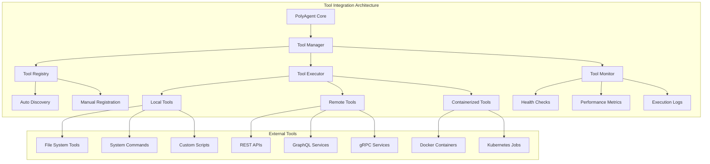
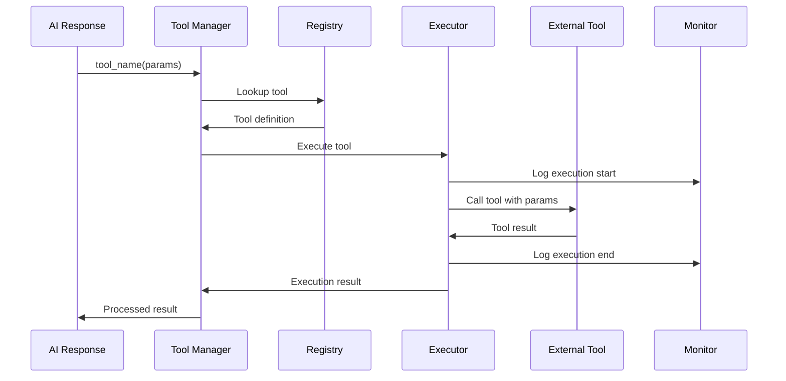
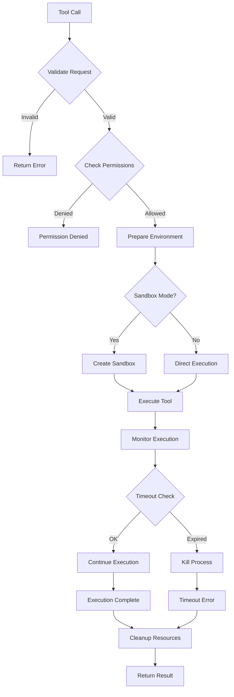
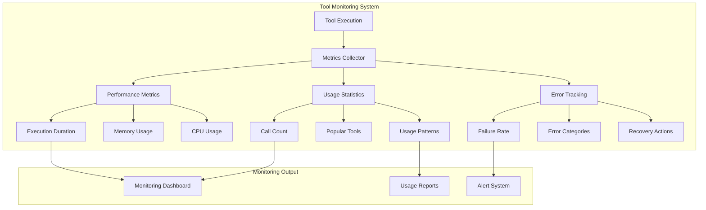

# Tools Module - External Tool Integrations

## Overview

Tools模块负责PolyAgent与外部工具和服务的集成，提供了可插拔的工具生态系统。遵循Unix哲学中"组合胜于继承"的原则，每个工具都是独立的可执行组件，可以通过简单的接口进行组合。

## Architecture



## Tool Integration Flow



## Tool Types

### 1. File System Tools

#### File Operations
```python
# tools/filesystem.py
from core.tools import register_tool
import os
import shutil

@register_tool("read_file")
def read_file(path: str, encoding: str = "utf-8") -> str:
    """Read content from a file"""
    try:
        with open(path, 'r', encoding=encoding) as f:
            return f.read()
    except FileNotFoundError:
        return f"Error: File '{path}' not found"
    except Exception as e:
        return f"Error reading file: {str(e)}"

@register_tool("write_file")  
def write_file(path: str, content: str, encoding: str = "utf-8") -> str:
    """Write content to a file"""
    try:
        os.makedirs(os.path.dirname(path), exist_ok=True)
        with open(path, 'w', encoding=encoding) as f:
            f.write(content)
        return f"Successfully wrote {len(content)} characters to '{path}'"
    except Exception as e:
        return f"Error writing file: {str(e)}"

@register_tool("list_directory")
def list_directory(path: str = ".", pattern: str = "*") -> str:
    """List files in a directory"""
    import glob
    try:
        files = glob.glob(os.path.join(path, pattern))
        return "\n".join(files) if files else "No files found"
    except Exception as e:
        return f"Error listing directory: {str(e)}"
```

### 2. System Command Tools

```python
# tools/system.py
import subprocess
import shlex

@register_tool("run_command")
def run_command(command: str, timeout: int = 30) -> str:
    """Execute a system command safely"""
    try:
        # Security: Use shlex to safely parse command
        cmd = shlex.split(command)
        
        # Blacklist dangerous commands
        dangerous = ['rm -rf', 'del', 'format', 'fdisk', 'dd']
        if any(danger in command.lower() for danger in dangerous):
            return "Error: Dangerous command blocked"
            
        result = subprocess.run(
            cmd, 
            capture_output=True, 
            text=True, 
            timeout=timeout,
            check=False
        )
        
        output = result.stdout
        if result.stderr:
            output += f"\nSTDERR: {result.stderr}"
            
        return output or f"Command executed (exit code: {result.returncode})"
        
    except subprocess.TimeoutExpired:
        return f"Error: Command timed out after {timeout} seconds"
    except Exception as e:
        return f"Error executing command: {str(e)}"

@register_tool("get_system_info")
def get_system_info() -> str:
    """Get system information"""
    import platform
    import psutil
    
    info = {
        "Platform": platform.system(),
        "Release": platform.release(), 
        "CPU Cores": psutil.cpu_count(),
        "Memory": f"{psutil.virtual_memory().total // (1024**3)} GB",
        "Disk Space": f"{psutil.disk_usage('/').total // (1024**3)} GB"
    }
    
    return "\n".join([f"{k}: {v}" for k, v in info.items()])
```

### 3. Web API Tools

```python
# tools/web_api.py
import httpx
import json

@register_tool("http_get")
async def http_get(url: str, headers: dict = None, timeout: int = 10) -> str:
    """Make HTTP GET request"""
    try:
        async with httpx.AsyncClient(timeout=timeout) as client:
            response = await client.get(url, headers=headers or {})
            response.raise_for_status()
            
            # Try to parse as JSON, fallback to text
            try:
                data = response.json()
                return json.dumps(data, indent=2, ensure_ascii=False)
            except:
                return response.text
                
    except httpx.HTTPStatusError as e:
        return f"HTTP Error {e.response.status_code}: {e.response.text}"
    except Exception as e:
        return f"Request failed: {str(e)}"

@register_tool("http_post")
async def http_post(url: str, data: dict = None, headers: dict = None, timeout: int = 10) -> str:
    """Make HTTP POST request"""
    try:
        headers = headers or {"Content-Type": "application/json"}
        
        async with httpx.AsyncClient(timeout=timeout) as client:
            response = await client.post(
                url, 
                json=data, 
                headers=headers,
                timeout=timeout
            )
            response.raise_for_status()
            
            try:
                result = response.json()
                return json.dumps(result, indent=2, ensure_ascii=False)
            except:
                return response.text
                
    except Exception as e:
        return f"POST request failed: {str(e)}"
```

### 4. Data Processing Tools

```python
# tools/data_processing.py
import pandas as pd
import json

@register_tool("parse_csv")
def parse_csv(file_path: str, delimiter: str = ",") -> str:
    """Parse CSV file and return summary"""
    try:
        df = pd.read_csv(file_path, delimiter=delimiter)
        
        summary = {
            "rows": len(df),
            "columns": len(df.columns),
            "column_names": list(df.columns),
            "data_types": df.dtypes.to_dict(),
            "preview": df.head().to_dict('records')
        }
        
        return json.dumps(summary, indent=2, default=str)
        
    except Exception as e:
        return f"Error parsing CSV: {str(e)}"

@register_tool("json_query")
def json_query(json_data: str, query: str) -> str:
    """Query JSON data using JSONPath-like syntax"""
    try:
        import jsonpath_ng
        
        data = json.loads(json_data)
        parser = jsonpath_ng.parse(query)
        matches = [match.value for match in parser.find(data)]
        
        return json.dumps(matches, indent=2, ensure_ascii=False)
        
    except Exception as e:
        return f"JSON query failed: {str(e)}"
```

## Tool Discovery & Registration

### Automatic Discovery

```python
# tools/discovery.py
import os
import importlib
import inspect
from pathlib import Path

class ToolDiscovery:
    def __init__(self, tools_dir: str = "tools"):
        self.tools_dir = Path(tools_dir)
        
    def discover_tools(self):
        """Automatically discover and register tools"""
        discovered = []
        
        for py_file in self.tools_dir.glob("*.py"):
            if py_file.name.startswith("__"):
                continue
                
            try:
                # Import module
                module_name = f"tools.{py_file.stem}"
                module = importlib.import_module(module_name)
                
                # Find registered tools
                for name, obj in inspect.getmembers(module):
                    if hasattr(obj, '_tool_registered'):
                        discovered.append({
                            "name": obj._tool_name,
                            "function": obj,
                            "module": module_name,
                            "file": str(py_file)
                        })
                        
            except Exception as e:
                print(f"Failed to load {py_file}: {e}")
                
        return discovered
```

### Tool Configuration

```yaml
# tools/config.yaml
tools:
  # Tool categories
  categories:
    filesystem:
      enabled: true
      safe_mode: true           # Restrict dangerous operations
      allowed_paths: ["/tmp", "./data"]  # Sandbox paths
      
    system:
      enabled: true
      command_whitelist:        # Only allow specific commands
        - "ls"
        - "cat" 
        - "grep"
        - "find"
      dangerous_patterns:       # Block dangerous patterns
        - "rm -rf"
        - "sudo"
        - "chmod 777"
        
    web_api:
      enabled: true
      timeout: 10
      max_response_size: "10MB"
      allowed_domains:          # Whitelist domains
        - "api.github.com"
        - "httpbin.org"
        
    data_processing:
      enabled: true
      max_file_size: "100MB"
      supported_formats: ["csv", "json", "xml", "yaml"]

  # Tool-specific settings
  specific:
    read_file:
      max_file_size: "10MB"
      allowed_extensions: [".txt", ".md", ".json", ".yaml"]
      
    run_command:
      timeout: 30
      max_output_size: "1MB"
      
    http_get:
      user_agent: "PolyAgent/1.0"
      follow_redirects: true
```

## Tool Execution Engine



## Security & Sandboxing

### Tool Permissions

```python
# tools/security.py
from enum import Enum
from typing import List, Dict

class ToolPermission(Enum):
    FILESYSTEM_READ = "filesystem:read"
    FILESYSTEM_WRITE = "filesystem:write"
    NETWORK_ACCESS = "network:access"
    SYSTEM_COMMAND = "system:command"
    PROCESS_CONTROL = "process:control"

class ToolSecurity:
    def __init__(self):
        self.permissions = {}
        self.sandbox_enabled = True
        
    def register_permissions(self, tool_name: str, permissions: List[ToolPermission]):
        """Register required permissions for a tool"""
        self.permissions[tool_name] = permissions
        
    def check_permission(self, tool_name: str, permission: ToolPermission) -> bool:
        """Check if tool has required permission"""
        tool_perms = self.permissions.get(tool_name, [])
        return permission in tool_perms
        
    def create_sandbox(self, tool_name: str) -> Dict:
        """Create sandboxed environment for tool execution"""
        sandbox_config = {
            "filesystem": {
                "readonly_paths": ["/usr", "/bin", "/lib"],
                "writable_paths": ["/tmp", "./sandbox"],
                "blocked_paths": ["/etc", "/root", "/home"]
            },
            "network": {
                "allowed_hosts": ["api.github.com", "httpbin.org"],
                "blocked_ports": [22, 3389, 5432]  # SSH, RDP, PostgreSQL
            },
            "resources": {
                "max_memory": "256MB",
                "max_cpu_time": 30,
                "max_file_descriptors": 100
            }
        }
        return sandbox_config
```

## Tool Monitoring & Metrics



### Metrics Collection

```python
# tools/metrics.py
import time
from dataclasses import dataclass
from typing import Dict, List
import threading

@dataclass
class ToolMetric:
    tool_name: str
    execution_time: float
    success: bool
    error_message: str = ""
    memory_used: int = 0
    timestamp: float = 0

class ToolMetrics:
    def __init__(self):
        self.metrics: List[ToolMetric] = []
        self.lock = threading.Lock()
        
    def record_execution(self, tool_name: str, start_time: float, 
                        success: bool, error_message: str = ""):
        """Record tool execution metrics"""
        execution_time = time.time() - start_time
        
        metric = ToolMetric(
            tool_name=tool_name,
            execution_time=execution_time,
            success=success,
            error_message=error_message,
            timestamp=time.time()
        )
        
        with self.lock:
            self.metrics.append(metric)
            
    def get_statistics(self) -> Dict:
        """Get tool usage statistics"""
        with self.lock:
            if not self.metrics:
                return {}
                
            total_calls = len(self.metrics)
            successful_calls = sum(1 for m in self.metrics if m.success)
            
            tool_usage = {}
            for metric in self.metrics:
                if metric.tool_name not in tool_usage:
                    tool_usage[metric.tool_name] = {
                        "calls": 0,
                        "successes": 0,
                        "avg_time": 0,
                        "total_time": 0
                    }
                
                usage = tool_usage[metric.tool_name]
                usage["calls"] += 1
                usage["total_time"] += metric.execution_time
                if metric.success:
                    usage["successes"] += 1
                    
            # Calculate averages
            for tool, usage in tool_usage.items():
                usage["avg_time"] = usage["total_time"] / usage["calls"]
                usage["success_rate"] = usage["successes"] / usage["calls"]
                
            return {
                "total_calls": total_calls,
                "success_rate": successful_calls / total_calls,
                "tool_usage": tool_usage
            }
```

## Tool Development Guide

### Creating Custom Tools

```python
# Example: Custom weather tool
# tools/weather.py

from core.tools import register_tool
import httpx
import os

@register_tool("get_weather")
async def get_weather(location: str, units: str = "celsius") -> str:
    """
    Get current weather for a location
    
    Args:
        location: City name or coordinates
        units: Temperature units (celsius/fahrenheit)
        
    Returns:
        Weather information as formatted string
    """
    
    # Get API key from environment
    api_key = os.getenv('WEATHER_API_KEY')
    if not api_key:
        return "Error: Weather API key not configured"
    
    try:
        # Call weather API
        async with httpx.AsyncClient() as client:
            response = await client.get(
                f"https://api.openweathermap.org/data/2.5/weather",
                params={
                    "q": location,
                    "appid": api_key,
                    "units": "metric" if units == "celsius" else "imperial"
                }
            )
            response.raise_for_status()
            data = response.json()
            
        # Format response
        weather = {
            "location": data["name"],
            "temperature": f"{data['main']['temp']}°{'C' if units == 'celsius' else 'F'}",
            "description": data["weather"][0]["description"],
            "humidity": f"{data['main']['humidity']}%",
            "wind_speed": f"{data['wind']['speed']} m/s"
        }
        
        return "\n".join([f"{k}: {v}" for k, v in weather.items()])
        
    except httpx.HTTPStatusError as e:
        return f"Weather API error: {e.response.status_code}"
    except Exception as e:
        return f"Weather lookup failed: {str(e)}"

# Register required permissions
from tools.security import ToolSecurity, ToolPermission
security = ToolSecurity()
security.register_permissions("get_weather", [ToolPermission.NETWORK_ACCESS])
```

### Tool Testing

```python
# tools/test_tools.py
import asyncio
import pytest
from core.tools import call_tool

@pytest.mark.asyncio
async def test_get_weather():
    """Test weather tool"""
    result = await call_tool("get_weather", {"location": "London"})
    assert "London" in result
    assert "temperature" in result.lower()

@pytest.mark.asyncio 
async def test_file_operations():
    """Test file tools"""
    # Write file
    write_result = await call_tool("write_file", {
        "path": "/tmp/test.txt",
        "content": "Hello, World!"
    })
    assert "Successfully wrote" in write_result
    
    # Read file
    read_result = await call_tool("read_file", {"path": "/tmp/test.txt"})
    assert read_result == "Hello, World!"

def test_system_command():
    """Test system command tool"""
    result = call_tool("run_command", {"command": "echo 'Hello'"})
    assert "Hello" in result
```

## Usage Examples

### File Management
```bash
# In PolyAgent chat
> Can you read the config file?
Assistant: read_file(path="config.yaml")
[File contents displayed]

> Create a backup of this file
Assistant: write_file(path="config.backup.yaml", content="[file contents]")
Successfully wrote 1234 characters to 'config.backup.yaml'
```

### System Operations
```bash
> What's the current disk usage?
Assistant: run_command(command="df -h")
Filesystem      Size  Used Avail Use% Mounted on
/dev/sda1        20G   15G  4.2G  79% /
```

### Web API Integration
```bash
> Check the GitHub API status
Assistant: http_get(url="https://api.github.com/status")
{
  "status": "good",
  "last_updated": "2024-08-30T14:30:25Z"
}
```

---

*Tools模块体现了Unix"小工具大智慧"的哲学，每个工具专注于做好一件事，通过组合实现复杂功能。安全沙箱和权限控制确保了系统的可靠性。*